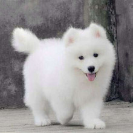

# 《css揭秘》

## 第二章 半透明边框
1. 半透明边框代码的实现：

```css
div {
      border: 10px solid hsla(0, 0%, 100%, .5);
      background: white;
      background-clip: padding-box;
}

```
`background-clip` 设置元素的背景是否延伸到边框下面

2. 多重边框

- `box-shadow` 解决方案

```css
      background: yellowgreen;
      box-shadow: 0 0 0 10px #655;
```

不过`box-shadow` 的好处在于，它支持逗号分隔语法，我们可以创建任意数量的投影，因此我们可以非常轻松地在上面的示例中再加上一道`deeppink` 颜色的“边框”：

```css
      background: yellowgreen;
      box-shadow: 0 0 0 10px #655, 0 0 0 15px deeppink;
```


- `outline` 解决方案

```css
      background: yellowgreen;
      border: 10px solid #655;
      outline: 5px solid deeppink;
```

最后的效果：


3. 灵活的背景定位

- `background-position` 扩展语法方案

`background-position` 属性已经得到扩展，它允许我们指定背景图片距离任意角的偏移量，只要我们在偏移量前面指定关键字。

举个栗子，我们想要背景图片距离右边缘保持`20px` 的偏移量，同时跟底边保持`10px`的偏移量，可以这样做。

```css
      background: url(code-pirate.svg) no-repeat #58a;
      background-position: right 20px bottom 10px;
```

效果图：


- `calc() 方案`

* 注意：请不要在`calc()` 函数内部的 `-` 和 `+` 运算符的两侧各加一个空白符，否则会产生解析错误！这个规则如此怪异，是为了向前兼容：未来，在`calc()` 内部可能会允许使用关键词，而这些关键词可能会含有连字符（即减号）

4. 边框内圆角

```html
      <div class="something-meaningful">
            <div>
                  内部有圆角，是不是看起来很棒。
            </div>
      </div>
```

```css
      .something-meaningful {
            padding: .8em;
            background: #655;
      }
      .something-meaningful > div {
            padding: 1em;
            border-radius: .8em;
            background: tan;
      }
```

## 第三章 形状

1. 自适应的椭圆
```
border-radius: 50%;
```
* 四分之一椭圆

> 要创建一个4/1 椭圆，其中一个角的水平和垂直半径都需要是100%，而其他三个角都不能设置为圆角。

```
border-radius: 100% 0 0 0;
```


2. 平行四边形

问题描述：

对于平行四边形的问题，有没有办法只让容器的形状倾斜，而保持其内容不变呢？

- 方法一、嵌套解决方案

我们可以在应用一次反向的`skew()`变形，从而抵消容器的变形效果。

```html
<a href="#" class="button">
      <div> Click me </div>
</a>
```

```css
      .button {
            transform: skewX(skewX(-45deg));
      }
      .button > div {
            transform: skewX(45deg);
      }
```

最终的效果图：


- 方法二、伪元素方案

实现的思路：

另一种思路是把所有样式（背景、边框）都应用到伪元素上，然后在对伪元素进行变形，因为我们的伪元素不是包含在伪元素内的，所以内容并不会收到影响。

```css
.button {
      position: relative;
      /* 其他文字颜色，内边距等样式 */
} 
.button::before {
      /* 用伪元素来生成一个矩形 */
      content:'';
      position: absolute;
      top: 0;
      right: 0;
      bottom: 0;
      left: 0;
      z-index: -1;
      background: #58a;
      transform: skewX(-45deg);
}
```


3. 菱形图片

- 基于变形的解决方案

需要把图片把一个`<div>` 包裹起来，然后对其应用相反的`rotate()`变形样式;

```html
      <div class="picture">
            
      </div>
```

```css
      .picture {
            width: 200px;
            transform: rotate(45deg);
            overflow: hidden;
      }
      .picture > img {
            max-width: 100%;
            transform: rotate(-45deg) scale(1.42);
      }
```


4. 切角效果

解决方案：

`css` 渐变，我们只需要一个线性渐变就可以达到目标，这个渐变需要把一个透明色标放在切角处，然后在相同位置设置另一个色标，并把其颜色设置为我们需要的背景色

```css
      background: #58a;
      background: linear-gradient(-45deg, transparent 15px, #58a 0);

```

最终效果：


- 两个切角的效果

两个切角的效果的话，主要在多加一层渐变，默认情况下，这两层渐变都会填充满整个元素，因此他们会互相覆盖，需要把他们的背景图都缩小一半，分别占据整个元素的一半的面积。

相关代码：

```css
background: #58a;
background: linear-gradient(-45deg, transparent 15px, #58a 0) right,linear-gradient(45deg, transparent 15px, #655 0) left;
background-size: 50% 100%;
background-repeat: no-repeat;

```

最终的效果：


- 弧形切角（内凹圆角）

实现的原理：

主要使用的方法就是径向渐变代替线性渐变。


上代码:

```css
background: #58a;
background: radial-gradient(circle at top left, transparent 15px, #58a 0 ) top left,radial-gradient(circle at top right, transparent 15px, #58a 0 ) top right,radial-gradient(circle at bottom left, transparent 15px, #58a 0 ) bottom left,radial-gradient(circle at bottom right, transparent 15px, #58a 0 ) bottom right;
background-size: 50% 50%;
background-repeat: no-repeat;
```

最终效果：


5. 梯形标签页

解决方案：

可以利用2D变形属性可以生成一个梯形

对元素使用了3D变形之后，其内部的变形效果是“不可逆转的”，这一点跟2D变形不同，唯一可行的途径就是把变形效果作用在伪元素上。这有些类似与我们在“平行四边形”一节中生成的平行四边形的方法。

上代码：

```css
      .tab {
            position: relative;
            display: inline-block;
            padding: .5em 1em .35em;
            color: white;
      }
      .tab::before {
            content: '';
            position: absolute;
            top: 0;
            right: 0;
            bottom: 0;
            left: 0;
            background: #58a;
            transform: perspective(.5em) rotateX(5deg);
      }

```

梯形效果图：


6. 简单的拼图

- 基于`transform` 的解决方案

上代码：

```html
      <div class="pie"></div>

```

```css
      .pie {
            width: 100px;
            height: 100px;
            border-radius: 50%;
            background: yellowgreen;
            background-image: linear-gradient(to right, transparent 50%, #650 0);
      }
      .pie::before {
            content: '';
            display: block;
            margin-left: 50%;
            height: 100%;
            border-radius: 0 100% 100% 0 / 50%;
            background: #655;
            transform-origin: left;
            transform: rotate(.1turn);
      }
```

拼图效果图：


## 第四章 视觉效果

1. 单侧阴影
2. 不规则阴影 
3. 染色阴影
4. 毛玻璃效果
5. 折角效果